# 클린 아키텍처, 헥사고날, 레이어드 아키텍처를 어떻게 구분할까

## 1) 문제 배경
최근 프로젝트를 클린 아키텍처로 구성하다 보면, "이게 헥사고날이랑 뭐가 다르지?"라는 질문이 자주 나온다. 특히 Go 백엔드에서 `handler`, `usecase`, `repository`, `adapter`를 나누기 시작하면 두 구조가 코드 레벨에서는 꽤 비슷하게 보인다.

여기에 DDD까지 함께 언급되면 더 헷갈리기 쉽다. 다만 DDD는 레이어드/헥사고날/클린처럼 시스템의 구조 형태를 직접 규정하는 아키텍처라기보다, 복잡한 도메인 규칙을 모델링하고 언어를 맞추기 위한 설계 접근에 가깝다. 이 문서에서는 DDD 자체를 깊게 다루기보다, 실무에서 자주 비교되는 세 가지 아키텍처의 차이를 중심으로 정리한다.

## 2) 한눈에 보는 구조
세 아키텍처의 핵심 흐름을 먼저 보면, 어디서 경계를 두는지 빠르게 감을 잡기 쉽다.

```mermaid
flowchart TB
    subgraph Layered["Layered Architecture"]
        L1["handler / controller"] --> L2["service"]
        L2 --> L3["repository"]
        L3 --> L4["database"]
    end

    subgraph Hexagonal["Hexagonal Architecture"]
        H1["inbound adapter"] --> H2["usecase / application"]
        H2 --> H3["outbound port"]
        H3 --> H4["outbound adapter"]
    end

    subgraph Clean["Clean Architecture"]
        C1["framework / driver"] --> C2["interface adapter"]
        C2 --> C3["usecase"]
        C3 --> C4["entity"]
    end
```



짧게 정리하면, 레이어드는 계층 흐름을 단순하게 가져가는 데 강점이 있고, 헥사고날/클린은 내부 로직을 외부 기술에서 분리하는 경계 설정을 더 강조한다.

## 3) 레이어드 아키텍처
레이어드 아키텍처는 보통 다음 흐름으로 설명한다.

- `handler/controller -> service -> repository -> database`

요청이 들어오면 상위 계층에서 하위 계층으로 내려가며 처리한다. 팀에 처음 합류한 사람도 호출 흐름을 읽기 쉬운 편이고, CRUD 중심 서비스에서는 구현 비용이 비교적 낮을 수 있다.

### 장점
- 코드 흐름이 직관적이다.
- 역할 분리가 단순해서 온보딩이 빠른 편이다.
- 단순 업무 시스템이나 초기 MVP에서 생산성이 좋을 수 있다.

### 단점(조건 포함)
- 도메인 규칙, 외부 API 연동, 트랜잭션 처리, 이벤트 발행 같은 책임이 계속 `service`에 모이면 `service`가 비대해지기 쉽다.
- 레이어드 자체가 문제라기보다, 계층 분리만 있고 도메인 경계와 의존성 방향을 관리하지 않으면 DB 모델 중심으로 로직이 흘러가기 쉽다.
- 테스트가 DB/프레임워크에 묶이면 빠른 피드백 루프를 만들기 어렵다.

다만 이것이 레이어드의 일반 법칙은 아니다. 단순 CRUD, 작은 운영 도구, 빠른 MVP에서는 여전히 충분히 실용적인 선택이 될 수 있다.

## 4) 헥사고날 아키텍처 (Ports and Adapters)
헥사고날 아키텍처의 핵심은 내부 애플리케이션/도메인 로직과 외부 시스템을 분리하는 데 있다. HTTP, DB, 메시지 브로커, 외부 API 같은 요소는 Adapter로 보고, 내부는 Port(인터페이스)를 통해 필요한 기능만 바라본다.

Go에서 주문 저장이 필요하다고 하면 내부 포트는 다음처럼 둘 수 있다.

```go
type OrderRepository interface {
    Save(ctx context.Context, order Order) error
    FindByID(ctx context.Context, id string) (Order, error)
}
```

그리고 use case는 이 인터페이스에만 의존한다.

```go
type CreateOrderUseCase struct {
    orders OrderRepository
}
```

MySQL 구현은 바깥쪽 어댑터로 둔다.

```go
type MySQLOrderRepository struct {
    db *sql.DB
}
```

### 장점(전제 포함)
- 포트가 실제 변경 가능성(저장소 교체, 외부 API 변경)과 테스트 경계를 반영할 때, 외부 기술 교체에 유연해질 수 있다.
- 의존성 주입과 경계가 명확하면 테스트에서 어댑터를 목/페이크로 교체해 격리하기 쉬워진다.

### 단점
- 포트/인터페이스 수가 빠르게 늘면 구조가 무거워지고 인지 비용이 올라간다.
- 포트는 습관적으로 모든 구현체 앞에 붙이는 인터페이스가 아니라 경계를 위한 도구다.
- 인터페이스가 실제 변화 지점이나 테스트 경계를 반영하지 못하면 파일 수만 늘고 유지보수성이 떨어질 수 있다.

## 5) 클린 아키텍처
클린 아키텍처는 보통 다음 계층과 의존성 규칙으로 설명한다.

- Entity
- Use Case
- Interface Adapter
- Framework/Driver

핵심은 의존성이 항상 안쪽(비즈니스 규칙)으로 향해야 한다는 점이다. 즉, `UseCase`는 DB 드라이버, HTTP 프레임워크, 메시지 브로커 같은 구체 기술을 직접 알지 않는다.

왜 이렇게 구성하느냐면, 핵심 정책(비즈니스 규칙)이 외부 기술 변화에 덜 흔들리도록 하기 위해서다. 다만 이 장점은 인터페이스 설계, 도메인 경계, DI 구성이 함께 맞물릴 때 분명해진다.

복잡도가 낮은 CRUD 서비스에 동일한 수준으로 적용하면 파일 수와 추상화가 급격히 늘어날 수 있다. 클린/헥사고날은 구조 자체가 목적이 아니라, 핵심 로직을 외부 기술에서 보호하기 위한 수단이라는 점을 놓치지 않는 것이 중요하다.

## 6) 세 아키텍처의 차이 (실무 관점)
| 비교 기준 | 레이어드 | 헥사고날 | 클린 |
|---|---|---|---|
| 핵심 관심사 | 계층적 분리와 호출 흐름 | 내부 로직과 외부 시스템 경계 | 비즈니스 규칙 중심 + 의존성 규칙 |
| 코드 흐름 | 상위 -> 하위 계층 호출 | 유스케이스가 포트를 통해 외부 접근 | 바깥 계층이 안쪽 유스케이스를 호출 |
| 의존성 방향 | 보통 위 -> 아래 (구현 의존이 섞이기 쉬움) | 내부는 포트에 의존, 어댑터가 구현 | 모든 의존성이 안쪽을 향함 |
| 외부 시스템과의 경계 | 상대적으로 약할 수 있음 | 포트/어댑터로 명확히 분리 | 어댑터 계층으로 명확히 분리 |
| 구조가 무거워지는 지점 | 서비스에 책임 집중 | 포트/어댑터 과다 분리 | 계층별 추상화 과다 적용 |
| 과적용 시 부작용 | 서비스 비대화, DB 중심 사고 | 인터페이스 남발, 파일 증가 | 보일러플레이트 증가, 흐름 파악 지연 |
| 인터페이스/포트가 효과를 내는 조건 | 선택적(변경 지점 중심 권장) | 변화 지점/테스트 경계를 반영할 때 | 안쪽 규칙 보호 경계가 명확할 때 |
| 도메인 복잡도와의 관계 | 낮을 때 효율적 | 중간 이상에서 경계 관리 유리 | 높고 장기 규칙 유지 시 유리 |
| 초기 이해 난이도 | 낮은 편 | 중간~높음 | 중간~높음 |
| 테스트 격리 | 구조에 따라 편차 큼 | 경계 설계가 맞으면 좋은 편 | 유스케이스 중심으로 좋은 편 |
| 적합한 상황 | 단순 CRUD, 빠른 개발 | 외부 의존성 다양, 교체/격리 필요 | 복잡 규칙, 장기 유지보수, 테스트 중요 |

핵심은 "이름"보다 "경계가 실제로 지켜지는가"다. 같은 클린/헥사고날이라도 경계 설계가 부정확하면 효과가 줄고, 반대로 레이어드라도 경계를 잘 관리하면 충분히 안정적으로 운영할 수 있다.

## 7) 클린 아키텍처와 헥사고날 아키텍처의 관계
두 아키텍처는 완전히 다른 선택지라기보다, 내부 비즈니스 로직을 외부 기술에서 보호하려는 비슷한 방향의 구조다.

- 헥사고날: Port/Adapter 경계를 강조
- 클린: Entity, UseCase, Interface Adapter, Framework/Driver 계층과 의존성 방향을 더 명시적으로 설명

실무에서는 `usecase`, `port`, `adapter`, `repository interface` 같은 용어가 함께 등장한다. 그래서 둘을 완전히 별개의 선택지로 보기보다, 같은 문제(핵심 로직 보호)를 다른 관점으로 설명한 것으로 이해하면 설계 대화가 훨씬 수월해진다.

## 8) 실무적인 선택 기준
아키텍처 선택은 정답 고르기가 아니라, 프로젝트 복잡도와 변경 가능성에 맞춰 비용을 지불하는 결정에 가깝다.

- 단순 CRUD와 빠른 개발이 핵심이면 레이어드로도 충분할 수 있다.
- 외부 API/DB/메시지 브로커 의존성이 많고 교체 가능성, 테스트 격리가 중요하면 헥사고날/클린 방식이 유리할 수 있다.
- 도메인 규칙이 복잡하고 오래 유지해야 한다면 `UseCase`/`Domain` 중심 구조가 도움이 된다.
- 모든 기능에 같은 수준의 추상화를 강제하기보다, 변경 가능성이 높은 경계와 핵심 로직부터 점진적으로 적용하는 편이 현실적이다.

예를 들어 Go 서비스에서 처음엔 `handler-service-repository`로 시작하되, 결제/정산처럼 규칙이 복잡한 영역부터 `usecase + port/adapter`로 분리하는 방식도 가능하다.

## 9) 짧은 결론
레이어드는 단순성과 직관성이 장점이다. 다만 경계 관리가 약해지면 핵심 로직이 외부 기술이나 DB 모델 중심으로 끌릴 수 있다.

클린/헥사고날은 변경과 테스트를 위해 초기 복잡성을 감수하는 구조다. 하지만 모든 기능에 동일한 수준의 추상화를 적용할 필요는 없다.

결국 중요한 것은 아키텍처 이름이 아니라, 핵심 비즈니스 로직이 외부 기술(프레임워크, DB, 메시지 브로커)에 끌려가지 않도록 경계를 관리하는 일이다. 변경 가능성이 높거나 도메인 규칙이 중요한 부분부터 점진적으로 적용하는 편이 실무적으로 안전하다.
