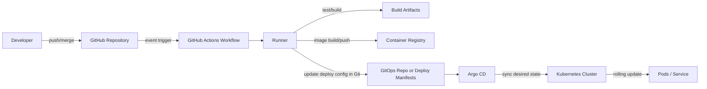
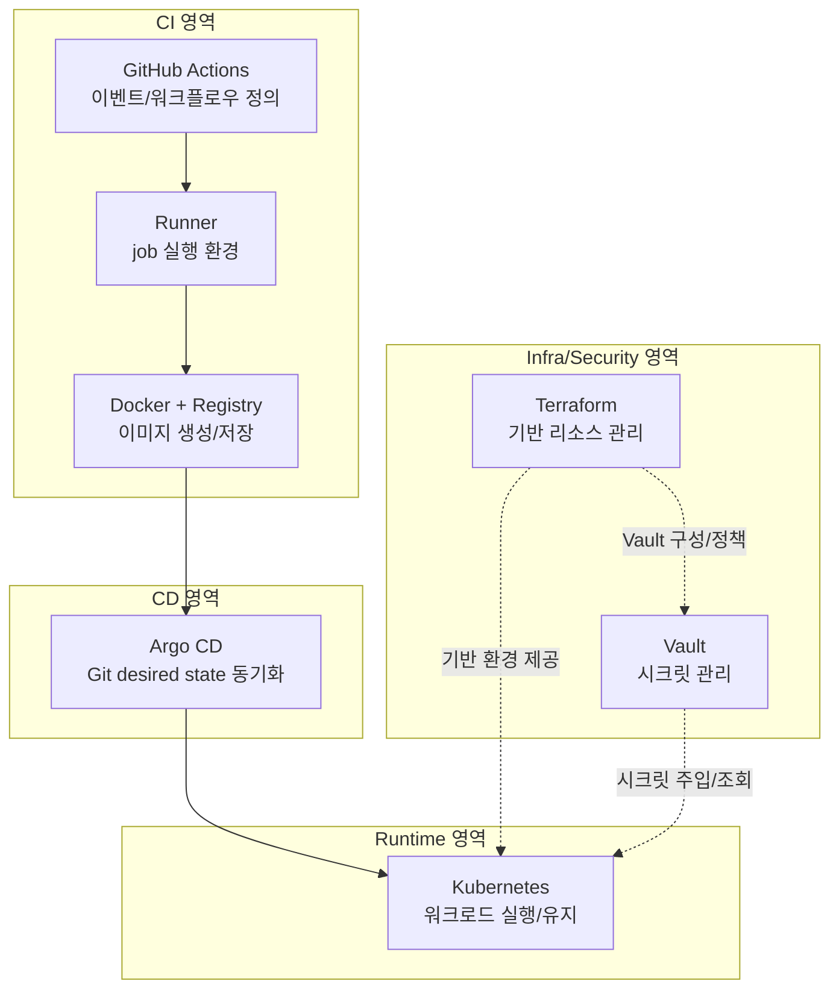

# GitHub Actions · Runner · Docker · Registry · Argo CD · Kubernetes · Terraform · Vault를 실무 흐름으로 구분해보기

처음 CI/CD와 인프라 자동화를 함께 다루면, GitHub Actions·Runner·Argo CD·Kubernetes·Terraform이 전부 비슷한 “배포 도구”처럼 보일 때가 많습니다. 저도 초반에는 경계가 흐릿했습니다.

특히 Argo CD를 Kubernetes 자체 기능으로 오해하거나, Terraform을 “인프라 전체를 다 알아서 만드는 도구”로 받아들이기 쉽습니다. 실제 운영 흐름을 기준으로 보면 각 도구의 책임은 꽤 명확하게 분리됩니다.

이 문서는 **브랜치 merge/push 이벤트 이후 어떤 순서로 무엇이 실행되는지**를 기준으로, 도구별 책임 경계를 다시 정리한 메모입니다.

---

## 먼저 전체 흐름 한 번에 보기

아래 흐름을 먼저 잡아두면, 뒤에서 도구별 설명이 훨씬 덜 헷갈립니다.

일반적인 흐름은 다음과 같습니다.

1. Git 이벤트(push/merge/tag 등)가 발생하고,
2. GitHub Actions workflow가 시작되며,
3. Runner가 테스트·빌드·이미지 생성 같은 실제 job을 수행하고,
4. 이미지가 Registry에 저장되거나 배포 설정이 Git 기준으로 갱신되고,
5. Argo CD가 원하는 상태(desired state) 변경을 감지해 Kubernetes에 반영하고,
6. Kubernetes가 Pod 교체와 서비스 반영을 수행합니다.

---

## 왜 헷갈리는가: 모두 자동화 도구지만 계층이 다르다

이 도구들은 같은 파이프라인에 등장하지만, 같은 일을 하는 것은 아닙니다.

- GitHub Actions: **언제/무엇을 실행할지 정의**
- Runner: **정의된 job을 실제 실행**
- Docker + Registry: **실행 가능한 이미지 생성/저장**
- Argo CD: **Git 선언 상태와 클러스터 실제 상태 동기화**
- Kubernetes: **컨테이너 워크로드 실제 실행/유지**
- Terraform: **실행 환경(인프라) 선언/프로비저닝**
- Vault: **시크릿·민감정보 저장/접근 제어**

문제가 생겼을 때도 “어느 계층의 책임인가”를 먼저 나누면 원인 분석이 빨라집니다.

---

## GitHub Actions: 실행 규칙을 정의하는 오케스트레이션 계층

GitHub Actions는 저장소 이벤트를 기준으로 workflow를 실행하는 도구입니다. 핵심은 **실행 머신 자체가 아니라 실행 규칙**이라는 점입니다.

자주 쓰는 트리거 예시는 다음과 같습니다.

- `push`: 특정 브랜치 push 시 실행
- `pull_request`: PR 검증 실행
- `tag`: 릴리스 태그 기준 파이프라인 실행
- `workflow_dispatch`: 수동 실행

즉, Actions는 “무엇을 언제 실행할지”를 기술하고, 각 step의 실제 명령은 runner에서 수행됩니다.

---

## Runner: workflow job이 실제로 돌아가는 실행 환경

**실행은 runner가 담당**합니다. Runner는 GitHub Actions job을 실제로 수행하는 머신/환경(예: VM, 컨테이너 호스트)입니다.

- GitHub-hosted runner
  - 운영 부담이 낮고 빠르게 시작하기 쉬움
  - 인터넷 기반 의존성 위주 파이프라인에 적합한 경우가 많음
- Self-hosted runner
  - 내부망·사내 레지스트리·사내 인증 체계 접근이 필요할 때 선택되는 경우가 많음
  - 커스텀 빌드 도구/보안 에이전트가 필요한 환경에 유리할 수 있음

선택 포인트는 성능만이 아니라 **네트워크 경계, 권한 모델, 감사 요구사항**입니다. self-hosted runner는 접근 권한이 커질 수 있어, 실행 격리·최소 권한·단기 자격증명 정책을 함께 설계하는 편이 안전합니다.

---

## Docker와 Runner의 관계: 필수 조건이라기보다 흔한 조합

Docker는 CI에서 매우 자주 쓰이지만, 모든 workflow에 필수는 아닙니다. 예를 들어 lint/정적 분석만 수행하는 job은 Docker 없이도 가능합니다.

다만 아래 상황에서는 Docker(또는 동등한 이미지 빌드 도구)가 많이 사용됩니다.

1. 애플리케이션 컨테이너 이미지 빌드
2. 테스트용 DB/Redis/Kafka 등 의존 서비스를 컨테이너로 구동
3. 생성된 이미지를 Registry로 push

조직 보안정책/빌드 환경에 따라 Kaniko, BuildKit, Buildah 같은 대안을 사용하기도 합니다. 중요한 것은 특정 도구명이 아니라, **이미지 생성·검증·저장 과정을 어떤 권한 경계에서 수행하는지**입니다.

---

## Argo CD: Kubernetes 위에서 동작하는 GitOps 기반 CD 도구

Argo CD는 Kubernetes 자체가 아니라, **Kubernetes 위에 배포되어 동작하는 CD 도구**입니다.

Argo CD의 핵심 역할은 다음과 같습니다.

- Git에 선언된 desired state(원하는 상태)와
- 클러스터의 actual state(실제 상태)
- 두 상태 차이를 줄이도록 동기화

배포 자산은 보통 manifest/Helm/Kustomize 같은 선언형 구성을 사용합니다.

이 방식은 “CI가 배포 대상에 직접 접속해서 즉시 변경”하는 패턴과 다를 수 있습니다. GitOps에서는 일반적으로 Git을 기준 상태로 두고, Argo CD가 이를 반영합니다.

---

## Kubernetes: 실제 애플리케이션을 실행·유지하는 런타임 플랫폼

Kubernetes는 컨테이너 워크로드를 실제로 실행하고, 상태를 유지하는 런타임입니다.

- Pod 스케줄링 및 실행
- 실패 Pod 재시작
- replica 유지
- rolling update
- Service를 통한 트래픽 연결

정리하면,

- Argo CD는 “원하는 상태를 동기화”하고,
- Kubernetes는 “동기화된 상태를 실제로 실행/운영”합니다.

두 역할을 분리해 이해하면, 배포 성공·서비스 장애처럼 계층이 다른 문제를 더 정확히 구분할 수 있습니다.

---

## Terraform: 애플리케이션이 동작할 기반 환경을 코드로 관리

Terraform은 보통 **IaC(Infrastructure as Code) 도구**로 사용되며, 설정은 주로 HCL 기반으로 작성합니다.

주요 관리 대상 예시는 다음과 같습니다.

- 클러스터/네트워크/로드밸런서
- IAM 및 정책
- DB/캐시/메시징
- Registry, DNS, 인증서, 보안 관련 리소스

핵심은 Terraform이 “애플리케이션 배포 자체”를 직접 담당한다기보다, **애플리케이션이 실행될 환경을 재현 가능하게 준비/변경**하는 데 강하다는 점입니다.

또한 Terraform이 Vault를 대체하는 것은 아닙니다. Terraform으로 Vault 정책/권한/리소스 구성을 관리할 수 있지만, 시크릿 값의 저장·회전·접근 통제 자체는 Vault 같은 전용 도구가 담당하는 구조가 일반적입니다.

---

## Vault: 시크릿·민감 정보 관리 계층

Vault는 토큰, DB 비밀번호, API 키, 인증서 같은 민감 정보를 안전하게 저장하고 접근을 통제하는 용도로 사용됩니다.

실무에서 중요한 점은 다음입니다.

- 시크릿 원문을 Git 저장소에 커밋하지 않기
- 장기 고정 자격증명보다 단기/동적 자격증명 선호
- 서비스/환경별 접근 정책 분리
- 감사 로그와 회전(rotate) 정책 운영

GitHub Actions Secrets, Vault, Kubernetes Secret은 서로 대체 관계라기보다 역할이 겹치는 일부 구간을 가진 구성 요소입니다. 어떤 저장소/주입 경로를 쓸지는 보안 정책과 운영 편의성에 따라 달라질 수 있습니다.

---

## Monorepo에서 Terraform 구성: 흔한 패턴과 선택 포인트

모노레포에서 서비스가 늘어나면 Terraform도 서비스/환경 단위로 경계를 나누는 편이 관리에 유리한 경우가 많습니다.

흔히 보이는 구조 예시는 다음과 같습니다.

- 재사용 모듈: `modules/`
- 환경별 진입점: `envs/dev`, `envs/stage`, `envs/prod`

다만 이 구조가 유일한 정답은 아닙니다. 조직에 따라 계정 구조, 승인 절차, 팀 분리 방식이 달라서 별도 인프라 저장소나 다른 디렉터리/워크스페이스 전략이 더 맞을 수 있습니다.

---

## GitHub Actions와 Argo CD 연결 방식

실무에서 자주 보이는 패턴은 아래 두 가지입니다.

1. **GitOps 중심 방식**
   - Actions가 이미지 빌드/푸시 후 배포 설정(image tag 등)을 Git에 반영
   - Argo CD가 Git 변경을 감지해 동기화
2. **동기화 트리거 방식**
   - 필요 시 Actions가 Argo CD CLI/API를 통해 동기화를 요청

어떤 방식을 선택할지는 배포 승인 모델, 감사 추적 요구, 운영 자동화 수준에 따라 달라질 수 있습니다. 한 방식만 정답이라고 보기는 어렵습니다.

---

## 짧은 실무 시나리오: dev 브랜치 merge 이후

예시 시나리오(조직에 따라 일부 단계는 달라질 수 있음):

1. feature 브랜치가 `dev`로 merge
2. `on: push`(dev) workflow 실행
3. runner에서 테스트 수행
4. 통과 시 이미지 빌드 후 Registry push
5. 배포 설정(예: values의 image tag) 갱신 커밋
6. Argo CD가 변경 감지 후 sync
7. Kubernetes가 rolling update 수행
8. readiness 통과 후 트래픽 점진 전환

프로덕션 환경에서는 여기에 수동 승인, 권한 분리, 배포 창(window), 자동/수동 롤백 정책 같은 운영 절차가 추가되는 경우가 많습니다.

---

## 책임 경계를 다시 시각화

---

## 결론: 같은 자동화 파이프라인, 다른 책임

이 도구들은 모두 배포 자동화에 기여하지만, 책임은 분리되어 있습니다.

- **GitHub Actions**: 언제/무엇을 실행할지
- **Runner**: 어디서 실행할지
- **Docker/Registry**: 무엇을 패키징하고 저장할지
- **Argo CD**: 선언된 배포 상태를 어떻게 동기화할지
- **Kubernetes**: 애플리케이션을 어떻게 실행·유지할지
- **Terraform**: 실행 환경을 어떻게 재현 가능하게 준비할지
- **Vault**: 민감 정보를 어떻게 안전하게 관리할지

자동화는 속도를 높여주지만, 자동화만으로 안전성이 보장되지는 않습니다. 실제 운영에서는 권한 분리, 검증, 승인, 롤백 전략까지 함께 설계해야 안정적으로 운영할 수 있습니다.
